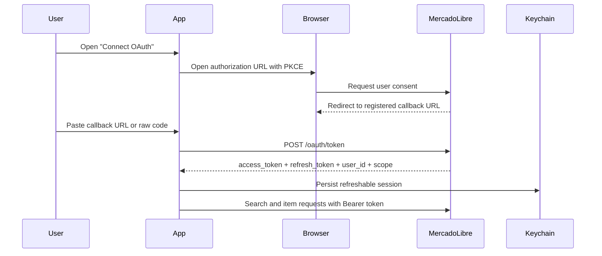
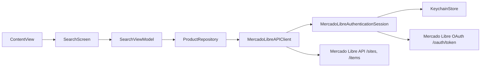

# MeLi Lite

MeLi Lite is a SwiftUI iOS challenge app that implements product search and product detail using an MVVM architecture, modern async/await networking, explicit error handling, and unit/UI tests.

## What is included

- Product search flow with user feedback for idle, loading, empty, success and failure states.
- Product detail flow with image gallery, pricing, shipping, attributes and external link.
- MVVM by feature with a repository-driven data layer.
- Demo catalog enabled by default so the app stays fully navigable even when Mercado Libre blocks anonymous requests.
- Demo placeholders are local-only, so the default experience also works in sandboxed environments without outbound network access.
- Live API wiring prepared through environment variables, `MELI_ACCESS_TOKEN`, or interactive OAuth.
- Local OAuth bootstrap that can open Mercado Libre authorization, accept a pasted callback URL, exchange tokens, persist them in Keychain, and refresh them automatically.
- Architecture and AI usage documentation under [`docs/ARCHITECTURE.md`](/Users/juandiegoocampo/Downloads/MeLi-Lite/docs/ARCHITECTURE.md) and [`docs/AI_USAGE.md`](/Users/juandiegoocampo/Downloads/MeLi-Lite/docs/AI_USAGE.md).

## Live API note

The PDF states that search works without authentication, but current Mercado Libre behavior does not match that anymore.

- On April 2, 2026, `GET https://api.mercadolibre.com/sites/MLA/search?q=iphone&limit=1` returned `403 forbidden`.
- On April 2, 2026, `GET https://api.mercadolibre.com/products/MLA10025564` returned `authorization value not present`.
- Mercado Libre official documentation for `Items & Searches`, crawled on March 2026, now documents bearer-token usage for current search-related resources.

Because of that, the app defaults to demo mode and keeps the live integration behind configuration.

## OAuth support

The current live integration is centered around [`MercadoLibreAuthenticationSession.swift`](/Users/juandiegoocampo/Downloads/MeLi-Lite/MeLi-Lite/Core/MercadoLibreAuthenticationSession.swift). That session object is created at app startup, injected through [`AppContainer.swift`](/Users/juandiegoocampo/Downloads/MeLi-Lite/MeLi-Lite/App/AppContainer.swift), and used by the live repository before every authenticated request.

It supports three live credential sources:

- `MELI_ACCESS_TOKEN` from the local process environment.
- A previously stored OAuth session from Keychain.
- A fresh authorization-code exchange started from the in-app OAuth sheet.

### Launch auth resolution


### Authorization-code flow



## Configuration

The shared scheme now starts in demo mode and does not ship a live token or client secret. Use demo mode with no extra setup, or enable live mode through local environment variables in your own scheme:

- `MELI_DATA_SOURCE=live`
- `MELI_ACCESS_TOKEN=<your token>`
- `MELI_SITE_ID=MCO`
- `MELI_APP_ID=<your Mercado Libre app id>`
- `MELI_CLIENT_SECRET=<your Mercado Libre client secret>`
- `MELI_REDIRECT_URL=https://your-domain/callback`
- `MELI_AUTH_HOST=auth.mercadolibre.com.co`

The shared scheme already includes:

- `MELI_DATA_SOURCE=demo`
- `MELI_SITE_ID=MCO`
- `MELI_APP_ID`
- `MELI_REDIRECT_URL`
- `MELI_AUTH_HOST`

The shared scheme intentionally excludes the real `MELI_CLIENT_SECRET`. Keep that value only in your local scheme or another unversioned configuration source.

`MELI_DATA_SOURCE` has explicit priority:

- `demo` forces local fixtures even if a token exists.
- `live` enables the live repository.
- if unset, the app still switches to live mode when `MELI_ACCESS_TOKEN` is present.

For local OAuth bootstrap, the app can:

- open the Mercado Libre authorization page,
- accept the callback URL pasted back into the app,
- exchange the authorization code for tokens,
- store the refreshable session in the Keychain,
- refresh that session automatically before live API calls.

### Recommended local setup

1. Open `Edit Scheme > Run > Environment Variables`.
2. Keep `MELI_DATA_SOURCE=demo` while you are not testing live requests.
3. Add `MELI_CLIENT_SECRET` only in your local scheme.
4. Switch `MELI_DATA_SOURCE=live` when you want to test authenticated calls.
5. Remove `MELI_ACCESS_TOKEN` if you want to exercise the interactive OAuth flow end-to-end.
6. Launch the app and use the OAuth sheet to authorize and paste the callback URL.

### Important limitation

The current redirect flow is manual on purpose.

- With an `https://...` redirect such as `https://jdocampom.com/meli/callback`, iOS will not route the callback back into the app automatically unless you configure Universal Links and associated domains.
- Because of that, the app currently expects the callback URL to be pasted into the OAuth sheet after browser authorization.
- If you want a zero-copy return path, the next step is to add Universal Links or move to a custom URL scheme redirect.

Before running in live mode, you can validate the local configuration with:

```sh
scripts/check_live_env.sh
```

The script exits early when demo mode is active and reports a clearer failure when Mercado Libre rejects the token with `401` or `403`.

## Runtime architecture



## Architecture

The app follows MVVM per feature:

- `Features/Search`: search UI plus `SearchViewModel`.
- `Features/Detail`: detail UI plus `ProductDetailViewModel`.
- `Domain`: app-facing models and repository contract.
- `Data`: live Mercado Libre client, DTO mapping, live repository factory and demo repository.
- `Core`: configuration, logging, OAuth session management, Keychain persistence and unified error model.

More detail is documented in [`docs/ARCHITECTURE.md`](/Users/juandiegoocampo/Downloads/MeLi-Lite/docs/ARCHITECTURE.md).

## Troubleshooting live auth

### `HTTP 401`

- The token is invalid, expired, revoked, or was generated for a different app secret lifecycle.
- Re-authorize through the OAuth sheet or provide a fresh `MELI_ACCESS_TOKEN`.

### `HTTP 403`

- The request reached Mercado Libre and was rejected as unauthorized for that resource.
- The app is already sending the bearer token in the `Authorization` header.
- Common causes are a token for the wrong user, a non-manager account grant, incorrect country/domain context, or a Mercado Libre-side restriction on the app or seller account.

### What the app now surfaces

- Current authentication state in the search banner and OAuth sheet.
- Stored `user_id` and `scope` after a successful token exchange.
- Clearer configuration and missing-token errors through [`AppError.swift`](/Users/juandiegoocampo/Downloads/MeLi-Lite/MeLi-Lite/Core/AppError.swift).

## Testing

- Swift Testing unit tests cover search state transitions, detail loading behavior and DTO mapping.
- XCTest UI tests cover the demo-mode happy path from search to detail.
