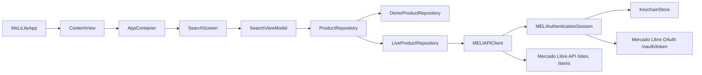
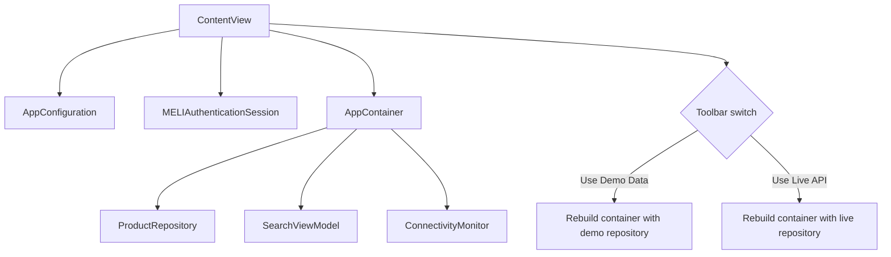
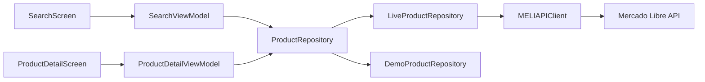
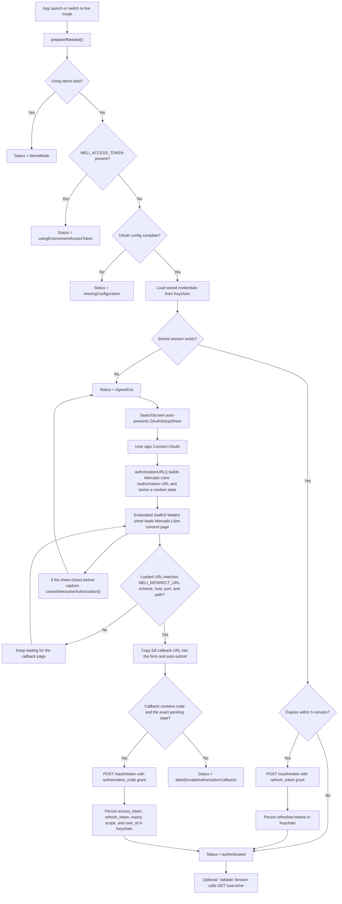
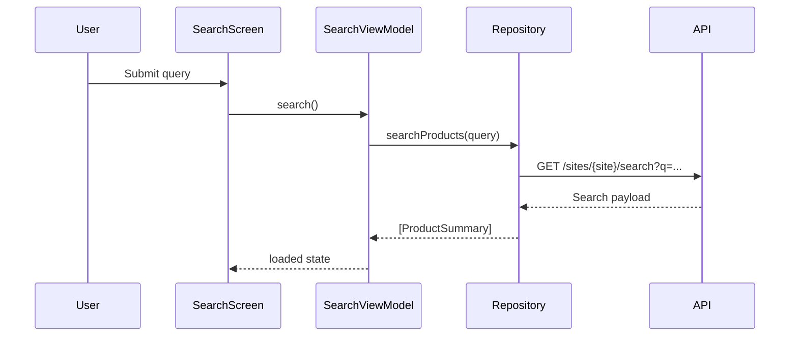

# MELISearch

MELISearch is a SwiftUI Mercado Libre sample app focused on product search and product detail flows. The project uses MVVM by feature, async/await networking, an explicit repository boundary, and two runtime data sources: deterministic demo fixtures and the live Mercado Libre API.

## Highlights

- Search, empty, loading, error, and detail states built with SwiftUI.
- `demo` mode backed by local fixtures for previews, CI, and offline review.
- `live` mode backed by Mercado Libre endpoints through an authenticated API client.
- OAuth session bootstrap with an embedded SwiftUI web view, automatic callback capture, strict redirect and state validation, token refresh, `/users/me` validation, and Keychain persistence.
- Runtime toolbar switch between `demo` and `live` without relaunching the app.
- Swift Testing unit coverage plus demo-mode UI smoke tests.

## Project Structure

- `MELISearch/App`: application entry point, dependency container, and root navigation.
- `MELISearch/Core`: configuration, error modeling, logging, reachability, OAuth, and Keychain storage.
- `MELISearch/Domain`: app-facing models and repository contract.
- `MELISearch/Data`: Mercado Libre endpoints, DTO mapping, API client, and repository factories.
- `MELISearch/Features/Search`: search screen, row UI, OAuth setup sheet, embedded authorization web view, and search view model.
- `MELISearch/Features/Detail`: detail screen and detail view model.
- `MELISearchTests`: Swift Testing unit tests.
- `MELISearchUITests`: XCTest UI smoke tests.

## Architecture

The app keeps UI code isolated from the transport layer:

- `ContentView` owns the active `AppContainer` and rebuilds it when the runtime data source changes.
- `SearchViewModel` and `ProductDetailViewModel` are `@Observable` `@MainActor` state holders for SwiftUI.
- `ProductRepository` hides whether data comes from demo fixtures or Mercado Libre.
- `MELIAPIClient` centralizes authenticated requests, decoding, status mapping, and light detail caching.
- `MELIAuthenticationSession` resolves the active live credential source and manages OAuth lifecycle work.

### Runtime architecture



### Composition root



### Layer overview



## Data Sources

### Demo mode

`demo` mode uses `DemoProductRepository` and in-memory fixtures only. It is the safest way to review the app because it does not depend on network connectivity or external API behavior.

### Live mode

`live` mode uses `LiveProductRepository`, `MELIAPIClient`, and `MELIAuthenticationSession`. The app still resolves and validates OAuth sessions, but public catalog requests can retry anonymously when Mercado Libre rejects the current bearer token with `403`.

The search screen exposes a runtime menu to switch between both modes. Switching mode rebuilds the app container and resets navigation and search state so the UI reflects the newly selected backend immediately.

## OAuth Flow

`MELIAuthenticationSession` supports three live credential sources:

1. `MELI_ACCESS_TOKEN` from the process environment.
2. A previously stored OAuth session loaded from Keychain.
3. A new authorization-code flow started from the in-app OAuth sheet.

The live auth bootstrap is intentionally deterministic so the app can reuse a working session before it asks the user to authorize again:

1. `demo` mode short-circuits all live auth work.
2. `MELI_ACCESS_TOKEN` wins immediately and enables live requests without touching Keychain.
3. If `MELI_APP_ID`, `MELI_CLIENT_SECRET`, or `MELI_REDIRECT_URL` is missing, the session surfaces `missingConfiguration`.
4. Otherwise the app loads a persisted session from Keychain using service `com.jdocampo.MeLi-Lite.mercadolibre.oauth` and an account derived from `MELI_APP_ID`.
5. Stored credentials refresh automatically when the access token will expire within the next five minutes.
6. If no reusable credentials exist, the search screen prompts the user to start an interactive authorization-code flow.

`SearchScreen` calls `prepareIfNeeded()` on first appearance and presents `OAuthSetupSheet` automatically when live mode is active, OAuth is fully configured, and no reusable session exists. `ContentView` also forwards incoming URLs through `onOpenURL`, so the same session can finish the auth flow if the callback is delivered back to the app directly.

Mercado Libre Dev Center requires an `https://` redirect URL. The shared `MELISearch` scheme therefore uses `MELI_REDIRECT_URL=https://jdocampom.com/meli/callback`, and the embedded browser only accepts callbacks that match that same redirect endpoint.

### Interactive auth behavior

- `authorizationURL()` creates a fresh in-memory `state`, switches the session to `.authorizing`, and builds the Mercado Libre `/authorization` URL.
- `OAuthAuthorizationWebViewSheet` loads that URL inside an embedded SwiftUI WebKit browser using `WebPage` and `WebView`.
- The sheet watches `page.url` and `page.isLoading`, and only captures the callback after the callback page finishes loading.
- A callback is accepted only when its scheme, host, port, and path exactly match `MELI_REDIRECT_URL`.
- The callback must also contain both `code` and the same `state` generated for the current attempt. Raw authorization codes, stale states, and mismatched hosts are rejected as `invalidAuthorizationCallback`.
- When the embedded browser reaches the registered callback, the full callback URL is copied into the form and the code exchange starts automatically. Manual paste-and-submit remains available as a fallback.
- The token exchange uses `POST https://api.mercadolibre.com/oauth/token` with `grant_type=authorization_code`. The current implementation validates `state` and does not send PKCE parameters.
- Successful responses persist `access_token`, `refresh_token`, expiration, `scope`, and `user_id` in Keychain. `signOut()` deletes that stored item.
- Closing the embedded browser before capture calls `cancelInteractiveAuthorization()`, which clears only the pending auth attempt and keeps any previously stored session intact.
- Public catalog endpoints such as `/sites/{site}/search` and `/items/{id}` retry once without the `Authorization` header when Mercado Libre returns `403` for the bearer token. Session validation with `/users/me` remains authenticated-only.

### End-to-end authentication lifecycle



### Session validation

After the app becomes authenticated, the banner and setup sheet can call `GET /users/me` to confirm which Mercado Libre account owns the current bearer token. This step does not change credential resolution, but it is useful when validating a refreshed session or checking which account is currently active.

## Environment Variables

The runtime configuration is resolved from scheme or process environment variables:

- `MELI_DATA_SOURCE`: `demo` or `live`.
- `MELI_SITE_ID`: Mercado Libre site identifier such as `MCO`.
- `MELI_ACCESS_TOKEN`: optional bearer token for immediate live access.
- `MELI_APP_ID`: OAuth client id.
- `MELI_CLIENT_SECRET`: OAuth client secret.
- `MELI_REDIRECT_URL`: redirect URL registered in Mercado Libre.
- `MELI_AUTH_HOST`: optional Mercado Libre auth host override. When omitted, the app derives the default host from `MELI_SITE_ID`.

For live mode, the app needs either:

- `MELI_ACCESS_TOKEN`, or
- a complete OAuth configuration made of `MELI_APP_ID`, `MELI_CLIENT_SECRET`, and `MELI_REDIRECT_URL`.

The shared `MELISearch` scheme currently includes live-mode environment variables. Review `Edit Scheme > Run > Environment Variables` before sharing the project, changing accounts, or validating a different Mercado Libre app configuration. UI tests override those values and always launch the app in `demo` mode.

## Running The App

1. Open `MELISearch.xcodeproj` in Xcode.
2. Select the `MELISearch` scheme.
3. Decide whether you want to review the app in `demo` or `live` mode.
4. If needed, adjust the environment variables in the scheme.
5. Run the app on macOS or iOS and use the toolbar menu to switch data source at runtime.
6. In `live` mode without `MELI_ACCESS_TOKEN`, let the app reuse Keychain first and then use `Connect OAuth` only when it prompts for interactive authorization.

If you want to validate a token from the shell before launching the app, run:

```sh
scripts/check_live_env.sh
```

The script exits early in `demo` mode and reports clearer failures for common live-mode authorization problems.

## Testing

Build tests from the command line with:

```sh
xcodebuild build-for-testing -project MELISearch.xcodeproj -scheme MELISearch -destination 'platform=macOS'
```

Run the suite with:

```sh
xcodebuild test -project MELISearch.xcodeproj -scheme MELISearch -destination 'platform=macOS'
```

Coverage currently includes:

- `AppConfiguration`, `AppError`, `ConnectivityMonitor`, and OAuth session behavior, including callback validation, redirect matching, refresh, and `/users/me` checks.
- `SearchViewModel` and `ProductDetailViewModel` state transitions.
- Mercado Libre DTO-to-domain mapping.
- Demo-mode UI smoke tests for launch, search, and navigation to detail.

### Request sequence



## Documentation

- The app source now includes SwiftDoc comments for the main types, properties, and behaviors across `App`, `Core`, `Domain`, `Data`, and feature modules.
- AI-assisted implementation notes live in [`docs/AI_USAGE.md`](docs/AI_USAGE.md).
