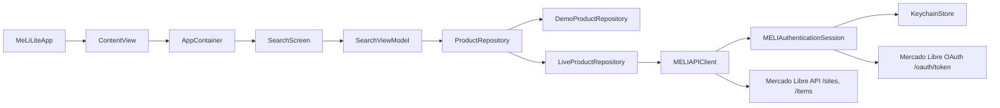
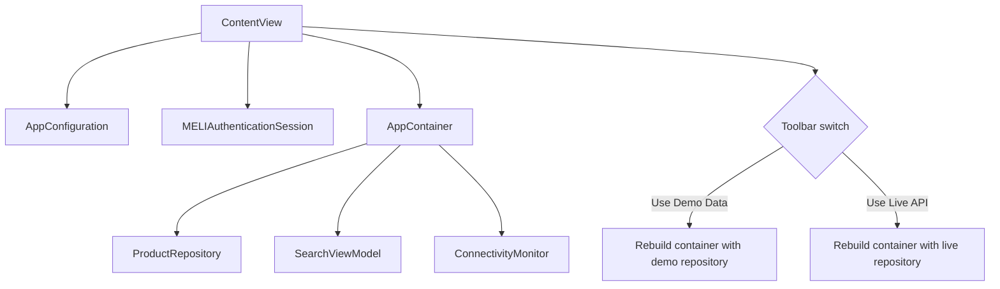
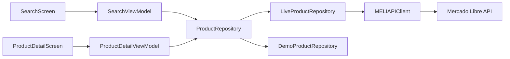
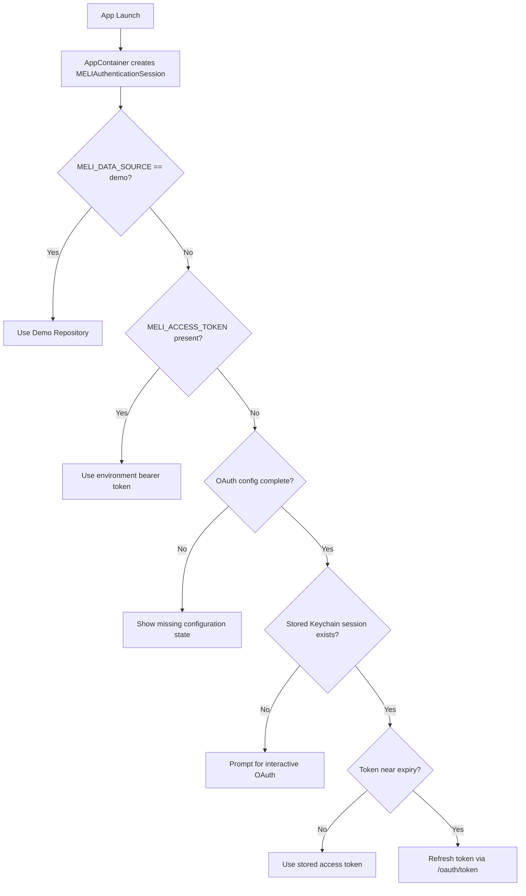
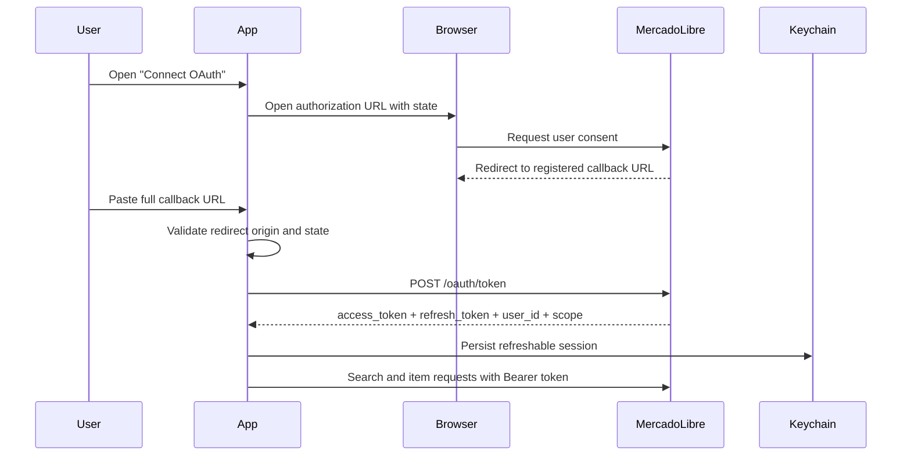
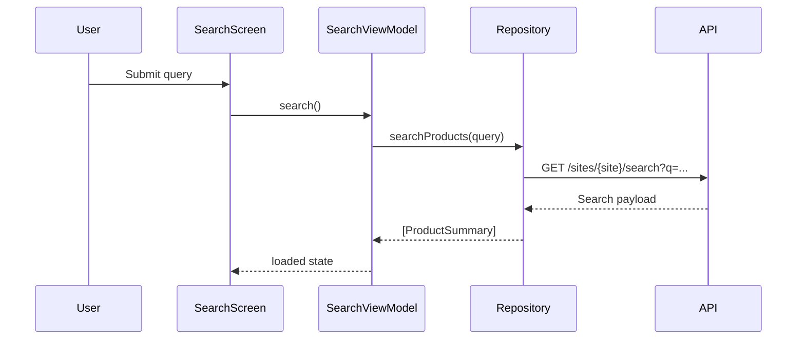

# MeLi Lite

MeLi Lite is a SwiftUI Mercado Libre sample app focused on product search and product detail flows. The project uses MVVM by feature, async/await networking, an explicit repository boundary, and two runtime data sources: deterministic demo fixtures and the live Mercado Libre API.

## Highlights

- Search, empty, loading, error, and detail states built with SwiftUI.
- `demo` mode backed by local fixtures for previews, CI, and offline review.
- `live` mode backed by Mercado Libre endpoints through an authenticated API client.
- OAuth session bootstrap with browser handoff, pasted callback validation, token exchange, refresh, and Keychain persistence.
- Runtime toolbar switch between `demo` and `live` without relaunching the app.
- Swift Testing unit coverage plus demo-mode UI smoke tests.

## Project Structure

- `MELISearch/App`: application entry point, dependency container, and root navigation.
- `MELISearch/Core`: configuration, error modeling, logging, reachability, OAuth, and Keychain storage.
- `MELISearch/Domain`: app-facing models and repository contract.
- `MELISearch/Data`: Mercado Libre endpoints, DTO mapping, API client, and repository factories.
- `MELISearch/Features/Search`: search screen, row UI, OAuth sheet, and search view model.
- `MELISearch/Features/Detail`: detail screen and detail view model.
- `MELISearchTests`: Swift Testing unit tests.
- `MELISearchUITests`: XCTest UI smoke tests.

## Architecture

The app keeps UI code isolated from the transport layer:

- `ContentView` owns the active `AppContainer` and rebuilds it when the runtime data source changes.
- `SearchViewModel` and `ProductDetailViewModel` are `@Observable` `@MainActor` state holders for SwiftUI.
- `ProductRepository` hides whether data comes from demo fixtures or Mercado Libre.
- `MELIAPIClient` centralizes authenticated requests, decoding, status mapping, and light detail caching.
- `MELIAuthenticationSession` resolves the active live credential source and manages OAuth lifecycle work.

### Runtime architecture



### Composition root



### Layer overview



## Data Sources

### Demo mode

`demo` mode uses `DemoProductRepository` and in-memory fixtures only. It is the safest way to review the app because it does not depend on network connectivity or external API behavior.

### Live mode

`live` mode uses `LiveProductRepository`, `MELIAPIClient`, and `MELIAuthenticationSession`. Mercado Libre product requests may reject anonymous access, so live requests should be treated as authenticated-only in practice.

The search screen exposes a runtime menu to switch between both modes. Switching mode rebuilds the app container and resets navigation and search state so the UI reflects the newly selected backend immediately.

## OAuth Flow

`MELIAuthenticationSession` supports three live credential sources:

1. `MELI_ACCESS_TOKEN` from the process environment.
2. A previously stored OAuth session loaded from Keychain.
3. A new authorization-code flow started from the in-app OAuth sheet.

The in-app OAuth flow is intentionally manual:

- The app opens Mercado Libre authorization in the system browser.
- After consent, the user pastes the full callback URL back into the app.
- The app validates the redirect origin and `state` before exchanging the code.
- The resulting session is stored in Keychain and refreshed automatically when needed.

Unless you add Universal Links or a custom URL scheme, the callback will not return to the app automatically.

### Launch auth resolution



### Authorization-code flow



## Environment Variables

The runtime configuration is resolved from scheme or process environment variables:

- `MELI_DATA_SOURCE`: `demo` or `live`.
- `MELI_SITE_ID`: Mercado Libre site identifier such as `MCO`.
- `MELI_ACCESS_TOKEN`: optional bearer token for immediate live access.
- `MELI_APP_ID`: OAuth client id.
- `MELI_CLIENT_SECRET`: OAuth client secret.
- `MELI_REDIRECT_URL`: redirect URL registered in Mercado Libre.
- `MELI_AUTH_HOST`: optional Mercado Libre auth host override.

For live mode, the app needs either:

- `MELI_ACCESS_TOKEN`, or
- a complete OAuth configuration made of `MELI_APP_ID`, `MELI_CLIENT_SECRET`, and `MELI_REDIRECT_URL`.

The shared `MELISearch` scheme currently includes live-mode environment variables. Review `Edit Scheme > Run > Environment Variables` before sharing the project, changing accounts, or validating a different Mercado Libre app configuration. UI tests override those values and always launch the app in `demo` mode.

## Running The App

1. Open `MELISearch.xcodeproj` in Xcode.
2. Select the `MELISearch` scheme.
3. Decide whether you want to review the app in `demo` or `live` mode.
4. If needed, adjust the environment variables in the scheme.
5. Run the app on macOS or iOS and use the toolbar menu to switch data source at runtime.

If you want to validate a token from the shell before launching the app, run:

```sh
scripts/check_live_env.sh
```

The script exits early in `demo` mode and reports clearer failures for common live-mode authorization problems.

## Testing

Build tests from the command line with:

```sh
xcodebuild build-for-testing -project MELISearch.xcodeproj -scheme MELISearch -destination 'platform=macOS'
```

Run the suite with:

```sh
xcodebuild test -project MELISearch.xcodeproj -scheme MELISearch -destination 'platform=macOS'
```

Coverage currently includes:

- `AppConfiguration`, `AppError`, `ConnectivityMonitor`, and OAuth session behavior.
- `SearchViewModel` and `ProductDetailViewModel` state transitions.
- Mercado Libre DTO-to-domain mapping.
- Demo-mode UI smoke tests for launch, search, and navigation to detail.

### Request sequence



## Documentation

- The app source now includes SwiftDoc comments for the main types, properties, and behaviors across `App`, `Core`, `Domain`, `Data`, and feature modules.
- AI-assisted implementation notes live in [`docs/AI_USAGE.md`](docs/AI_USAGE.md).
