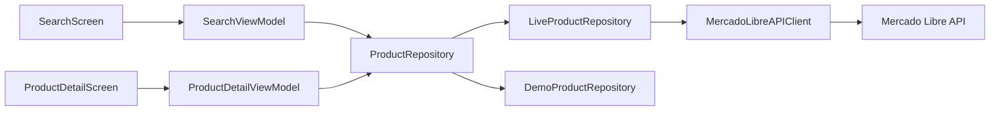
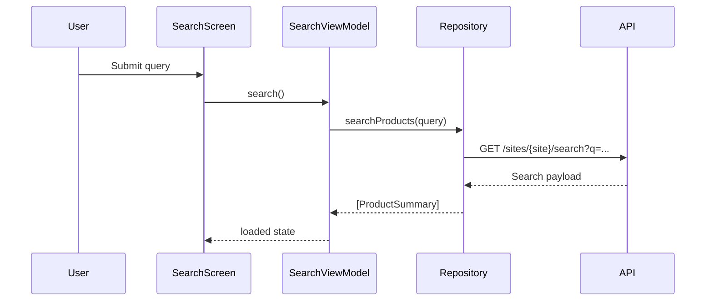

# Architecture

## Overview

The app uses MVVM by feature with a repository-driven data layer.

## Layers

### Presentation

- `SearchScreen` renders the search form and result states.
- `ProductDetailScreen` renders the detail content and progressively enriches the UI once the detail request finishes.
- SwiftUI state is kept in `@State` root-owned view models so orientation changes preserve the current flow.

### View Models

- `SearchViewModel` owns query state, result state and user feedback states.
- `ProductDetailViewModel` starts from a `ProductSummary`, loads the richer `ProductDetail`, and keeps summary data visible if the detail request fails.
- Both view models are `@Observable` and `@MainActor` because they coordinate UI-facing state.

### Domain

- `ProductSummary`, `ProductDetail`, `ProductAttribute` and `ShippingInfo` are plain models used by the UI.
- `ProductRepository` abstracts the origin of data and keeps the screens independent from networking details.

### Data

- `MercadoLibreAPIClient` performs async requests and centralizes HTTP, decoding and transport error mapping.
- `LiveProductRepository` exposes the challenge-oriented Mercado Libre flow through the repository contract.
- `DemoProductRepository` provides deterministic data for previews, tests and evaluation without credentials.

## Error handling

Developer-facing consistency:

- A single `AppError` type maps configuration, transport, HTTP and decoding failures.
- `OSLog` categories separate networking and UI errors.
- DTO mapping is covered by tests to reduce silent contract drift.

User-facing consistency:

- Search and detail screens both expose clear empty, loading and retry states.
- Summary data remains visible on the detail screen even if the secondary fetch fails.
- Demo mode is explicit in the UI to avoid misleading the evaluator.

## State preservation

- Search query, last submitted query and results live in a root-owned `SearchViewModel`.
- Navigation uses value-based `NavigationStack`, so returning from detail preserves the search results.
- Detail responses are cached in the live API client to avoid unnecessary repeated calls when revisiting the same item.

## Why not Core Data

The challenge does not require offline persistence, background sync or local editing. Adding Core Data here would increase complexity without improving the core evaluation points, so the app keeps data ephemeral and focused on search/detail responsiveness.

## Request sequence

